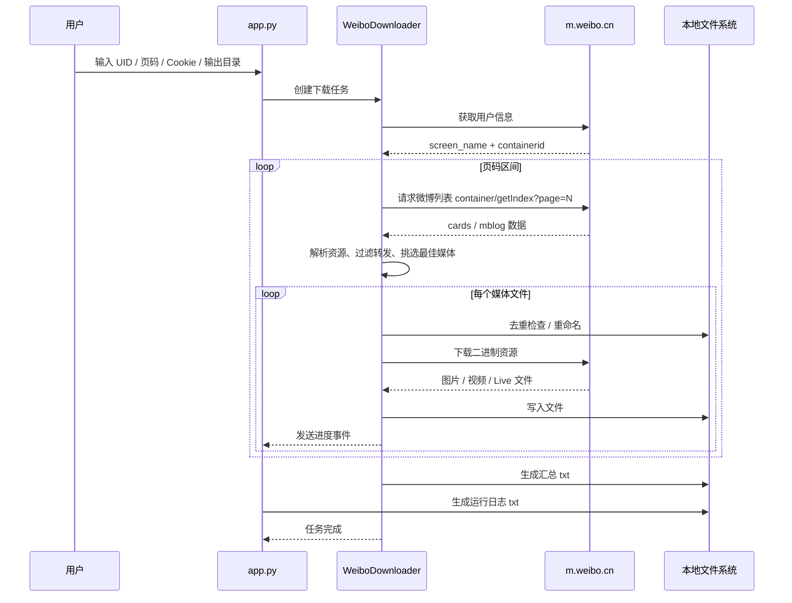

# 微博图片 / 视频 / Live 爬取工具说明文档

## 1. 项目概览

这是一个面向 macOS 的微博资源下载工具，使用 Python 编写，界面基于 PyObjC 调用原生 Cocoa 组件实现，最终可打包为可直接运行的 `.app` 应用。

当前工具的核心目标是：

- 输入微博用户 `UID`
- 指定起始页、结束页
- 读取微博列表接口
- 下载微博中的图片、视频、Live 资源
- 在本地生成下载结果、汇总文件和运行日志

核心代码文件：

- `app.py`：mac 原生 GUI、任务控制、日志展示、下载列表展示
- `weibo_downloader.py`：微博接口请求、Cookie 处理、资源解析、文件下载、摘要输出
- `tests/test_weibo_downloader.py`：下载器核心逻辑测试
- `build_mac_app.sh`：mac `.app` 打包脚本

## 2. 技术架构

```mermaid
flowchart LR
    U[用户] --> GUI[app.py<br/>WeiboCrawlerController]
    GUI --> Q[事件队列 Queue]
    GUI --> CFG[settings.json<br/>记住输出目录]
    GUI --> D[weibo_downloader.py<br/>WeiboDownloader]
    D --> C[Cookie/访客态管理]
    D --> API[m.weibo.cn API]
    D --> P[微博列表解析]
    D --> M[媒体选择器<br/>最大图/最高视频/Live]
    D --> F[本地文件系统]
    F --> OUT[@昵称_uid 目录]
    F --> SUM[汇总 txt]
    F --> LOG[Recode_日志 txt]
    D --> Q
    Q --> GUI
```

## 3. 模块说明

### 3.1 GUI 层

GUI 入口在 `app.py` 的 `WeiboCrawlerController`。

主要职责：

- 构建窗口与输入表单
- 接收 UID、页码区间、Cookie、输出目录
- 启动和停止下载任务
- 展示下载文件列表
- 展示运行日志
- 保存用户上次选择的输出目录
- 在登录失效后支持继续下载

关键方法：

- `build_window`：创建原生窗口和控件
- `layoutContent`：统一布局
- `startCrawl_`：开始下载 / 继续下载
- `stopCrawl_`：停止当前任务
- `clearCache_`：清理当前下载目录缓存
- `drainEvents_`：消费下载线程发回的事件，刷新界面

### 3.2 下载器层

下载器入口在 `weibo_downloader.py` 的 `WeiboDownloader`。

主要职责：

- 处理 Cookie 和访客态
- 请求微博用户信息和微博列表
- 从微博列表中提取可下载资源
- 选择最大尺寸图片、最高质量视频、Live 原始资源
- 过滤不符合规则的转发微博
- 处理断点继续
- 处理重名文件去重和重命名
- 生成汇总文件

关键方法：

- `set_cookie_string`：设置并规范化 Cookie
- `ensure_visitor_cookie`：尝试准备访客 Cookie
- `_request_json`：统一请求微博接口并处理登录/风控错误
- `get_user_info`：获取用户信息和微博容器信息
- `get_timeline_page`：按页获取微博列表
- `_collect_mblogs_from_cards`：从 `cards/card_group` 中提取 `mblog`
- `_download_binary`：下载单个媒体文件
- `download_user`：完整执行用户下载任务

## 4. 请求与下载流程



## 5. 当前下载规则

### 5.1 微博来源

当前直接读取微博列表接口：

- `https://m.weibo.cn/api/container/getIndex?...`

默认直接使用列表返回的 `mblog` 数据解析资源，不依赖逐条请求 `statuses/show`。

### 5.2 资源选择规则

- 图片：优先选择最大尺寸图片链接
- 视频：优先选择最高码率 / 最高分辨率链接
- Live / LivePhoto：优先提取原始视频资源，尽量保存为 `.mov`

### 5.3 转发微博过滤规则

如果当前微博是转发微博：

- 内容中包含 `@当前用户昵称`，则下载
- 不包含 `@当前用户昵称`，则跳过

普通微博不受此限制。

### 5.4 页码规则

界面使用：

- 起始页
- 结束页

程序只会下载这个闭区间内的微博页数据。

## 6. 文件输出规则

### 6.1 用户目录

用户下载目录命名格式：

```text
@用户昵称_用户id
```

例如：

```text
@测试用户_123456
```

### 6.2 资源文件命名

下载文件名会参考微博发布时间和微博文本内容，经过清洗后生成，尽量与现有命名风格保持一致。

### 6.3 重复文件处理

当目标文件已存在时：

- 如果内容完全相同：跳过，不重复下载
- 如果内容不同但文件名相同：自动重命名为 `文件名 (1)`、`文件名 (2)`、`文件名 (3)` ...

### 6.4 汇总文件

任务结束后，会在当前下载目录生成一个汇总 `.txt` 文件。

内容包括：

- 目录名
- 启始页
- 结束页
- 下载总数
- 本次第一条微博的发布日期
- 本次最后一条微博的发布日期

### 6.5 日志文件

任务结束后，会把运行日志保存为：

```text
Recode_YYYY-MM-DD HH-MM-ss.txt
```

## 7. 登录与容错

### 7.1 Cookie 机制

程序优先支持用户在界面中粘贴已登录微博 Cookie。

如果 Cookie 无效，下载器会在请求层直接抛出明确错误，而不是静默显示“没有更多微博”。

### 7.2 继续下载

当任务执行过程中遇到登录失效等异常时：

- GUI 会把开始按钮切换为“继续下载”
- 记录失败页码和微博位置
- 用户重新输入 Cookie 后，可以从失败位置继续执行

### 7.3 停止任务

GUI 提供“停止”按钮，可中断当前下载任务。

## 8. 界面说明

主界面包含以下区域：

- 微博 UID
- 起始页 / 结束页
- 输出目录
- 微博 Cookie
- 开始爬取 / 继续下载
- 停止
- 清除缓存
- 打开输出目录
- 下载文件列表
- 运行日志

界面下半部分使用上下分隔布局，下载文件列表和运行日志区域可以联动调整高度。

### 8.1 表单控件明细

当前界面实际使用到的表单控件如下：

- `NSTextField`
  - 微博 `UID` 输入框
  - `起始页` 输入框
  - `结束页` 输入框
  - `输出目录` 输入框
  - 标题和提示文字标签

- `NSTextView`
  - 微博 `Cookie` 多行输入框
  - 运行日志文本框

- `NSButton`
  - `开始爬取 / 继续下载`
  - `停止`
  - `清除缓存`
  - `打开输出目录`
  - `选择目录`

- `NSTableView`
  - 下载文件列表表格
  - 当前展示列为：
    - `状态`
    - `类型`
    - `大小`
    - `文件`

- `NSScrollView`
  - Cookie 输入区滚动容器
  - 下载文件列表滚动容器
  - 运行日志滚动容器

- `NSSplitView`
  - 下载文件列表区和运行日志区的上下分隔容器
  - 支持拖动分隔线调整两个区域的高度比例

- `NSOpenPanel`
  - 选择输出目录弹窗

### 8.2 控件与功能对应关系

- `微博 UID`：指定要下载的微博用户
- `起始页 / 结束页`：限定下载页码区间
- `输出目录`：指定下载根目录，并持久化记忆
- `微博 Cookie`：提供登录态，避免风控或空列表
- `开始爬取 / 继续下载`：启动任务，或在登录失效后从失败点恢复
- `停止`：中断当前下载任务
- `清除缓存`：删除当前用户对应下载缓存目录
- `打开输出目录`：在 Finder 中打开当前输出目录
- `下载文件列表`：实时展示资源下载结果
- `运行日志`：展示请求、跳过、失败、完成等过程日志

## 9. 本地配置与缓存

程序会在以下位置保存配置：

```text
~/Library/Application Support/WeiboCrawler/settings.json
```

目前用于记录：

- 上次选择的输出目录

## 10. 测试与打包

### 10.1 依赖与最低版本

当前项目依赖的最低版本要求如下：

- Python：`3.9+`
- requests：`>= 2.31.0`
- urllib3：`< 2`
- pyobjc-core：`>= 11.1`
- pyobjc-framework-Cocoa：`>= 11.1`
- pyinstaller：建议 `>= 6.x`

其中：

- `requests`：负责微博接口请求和资源下载
- `urllib3`：由请求链路依赖，当前项目限制在 `2` 以下
- `pyobjc-core`：Python 与 Objective-C 运行时桥接
- `pyobjc-framework-Cocoa`：调用 macOS Cocoa 原生界面组件
- `pyinstaller`：用于打包生成 macOS `.app`

### 10.2 运行测试

```bash
python3 -m unittest discover -s tests
```

### 10.3 本地运行

```bash
pip3 install -r requirements.txt
python3 app.py
```

### 10.4 打包 mac 应用

```bash
./build_mac_app.sh
```

打包产物位置：

- `dist/WeiboCrawler.app`

## 11. 目录结构

```text
weiboPicVideo/
├── app.py
├── weibo_downloader.py
├── tests/
│   └── test_weibo_downloader.py
├── requirements.txt
├── build_mac_app.sh
├── WeiboCrawler.spec
├── dist/
└── README.md
```

## 12. 后续维护建议

- 如果微博接口字段变化，优先检查 `build_post_record`
- 如果下载列表为空，优先检查 `_collect_mblogs_from_cards` 和 `_request_json`
- 如果媒体质量不符合预期，优先检查 `pick_best_image_url` 和 `pick_best_video_url`
- 如果遇到登录问题，优先检查 `set_cookie_string` 和 `_request_json` 的登录校验分支
